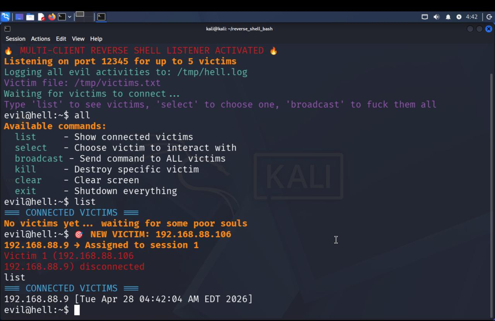

> ⚠️ **Disclaimer:** This project is for **educational purposes and ethical hacking labs only**. Unauthorized access to computer systems is illegal. Use this tool responsibly and only on systems you own or have explicit permission to test. 🚫

---

## 📖 Description

This is an advanced Bash-based **Multi-Session Reverse Shell Manager**. Unlike basic listeners, this tool allows you to manage multiple incoming connections (sessions) simultaneously from a single command-line interface. You can interact with one device, put it in the background, and switch to another without losing the connection.

### ✨ Key Features
* 👥 **Multi-Session Management:** Control multiple targets at once.
* 🔄 **Session Persistence:** Listeners and active sessions are tracked in a `/tmp/victims.txt` file.
* 📡 **Threaded Architecture:** Handles multiple connections concurrently using Bash threading.
* 💻 **Cross-Platform:** Optimized for macOS and Linux environments.

---

## 🛠 Requirements

* 🐍 **Linux or Mac**
* ☕ **Bash Script** (The script)
* 🌐 **Network Access:** Target and host must have connectivity in a lab environment.

---

---
## 🚀 Usage & Listeners

You can start multiple listeners by running this command:
```bash
chmod +x reverse_shell.sh && ./reverse_shell.sh <port:number> <max_victims:number>
```

## ⌨️ Control Interface `evil@hell:~$`

| Command        | Action                                                                 |
|----------------|------------------------------------------------------------------------|
| list           | 📋 List all victims connected to one specifc port.                     |
| select <id>    | 🔌 Swithc to another victim connected.                                 |
| broadcast      | 🔙 Broadcoast command to all victims.                                  |
| clear          | 🧹 Clears the terminal screen.                                         |
| kill <id>      | 🧹 Kill specific session.                                              |
| kill-all       | 🧹 Kill all sessions.                                                  |
| exit           | 🚪 Shuts down the manager and resets sessions.                         |

---

# Example

